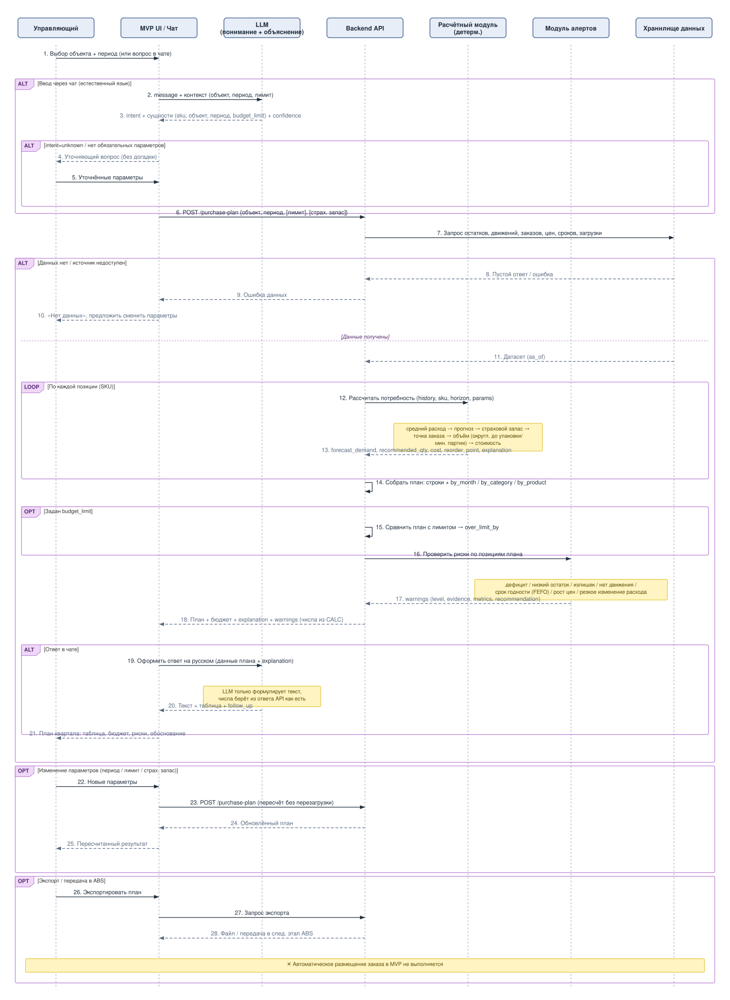
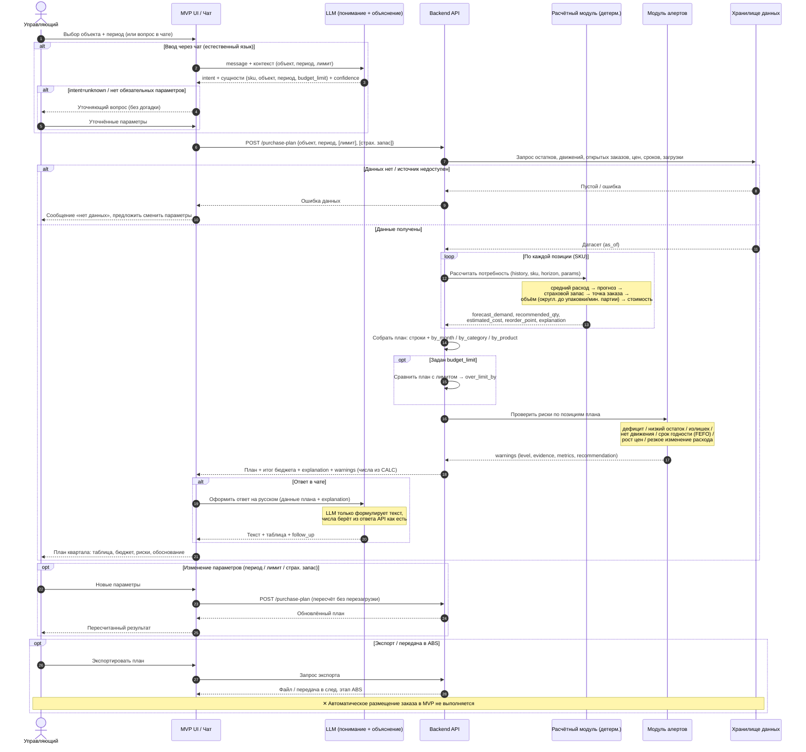

# Диаграмма последовательности: формирование плана закупок и бюджета на квартал

Бизнес-процесс из п. 2 `solution.md`. Актор — управляющий SPA-объекта.
Граница ответственности: **LLM** понимает запрос и объясняет, все числа считает **детерминированный расчётный модуль** (backend/DS); LLM не придумывает остатки, цены и объёмы.

## Экспорт в изображение

Векторная версия диаграммы (открывается в браузере/Preview, текст читается при любом зуме): [`uml.svg`](./uml.svg).



Регенерация после правок:

```bash
python3 Materials/render_uml.py Materials/uml.svg
```

> SVG рисуется скриптом `render_uml.py` (только стандартная библиотека Python, без внешних зависимостей). Модель событий в скрипте зеркалит Mermaid-блок ниже — при изменении диаграммы правьте оба места.

## Sequence diagram (Mermaid)



## Пояснения к участникам

| Участник | Роль | Источник в БТ |
| --- | --- | --- |
| **Управляющий** | Актор: задаёт объект/период или вопрос, меняет параметры, экспортирует | TO BE шаги 1, 7 |
| **MVP UI / Чат** | Интерфейс: форма и чат; не пересчитывает показатели, показывает числа из API как есть | Тестовое FE |
| **LLM** | Понимает запрос (интент, сущности) и формулирует ответ; числа не придумывает | Тестовое DS, Часть 3; БТ «Технологический стек» |
| **Backend API** | Оркестрация: `purchase-plan` / `forecast` / `budget` / `chat`; сборка плана и разрезов | Тестовое BE |
| **Расчётный модуль** | Детерминированные функции: средний расход, прогноз, точка заказа, объём, стоимость | TO BE шаг 3; `POST /api/forecast` |
| **Модуль алертов** | Дефицит, излишек, срок годности (FEFO), нет движения, рост цен и др. | TO BE шаг 5; 7 типов алертов |
| **Хранилище данных** | Остатки, движения, заказы, цены, сроки, плановая загрузка (`as_of`) | TO BE шаг 2; «Какие данные предоставлены» |

## Ключевые контрольные точки (что проверяем на приёмке)

- **Разделение ответственности:** все числа рождаются в `CALC`, LLM только формулирует (сообщения 12–14 выше).
- **Объяснимость:** каждый числовой вывод сопровождается `explanation` (data_used, period, formulas, assumptions, as_of).
- **Обработка неизвестного запроса:** `intent=unknown` → уточнение, а не выдуманный ответ.
- **Пересчёт без перезагрузки:** смена периода/лимита/страхового запаса запускает новый расчёт.
- **Запрет автозаказа:** экспорт возможен, автоматическое размещение заказа — нет.
